## June 25, 2026
- Daily update.
# Susatwik Manuri

  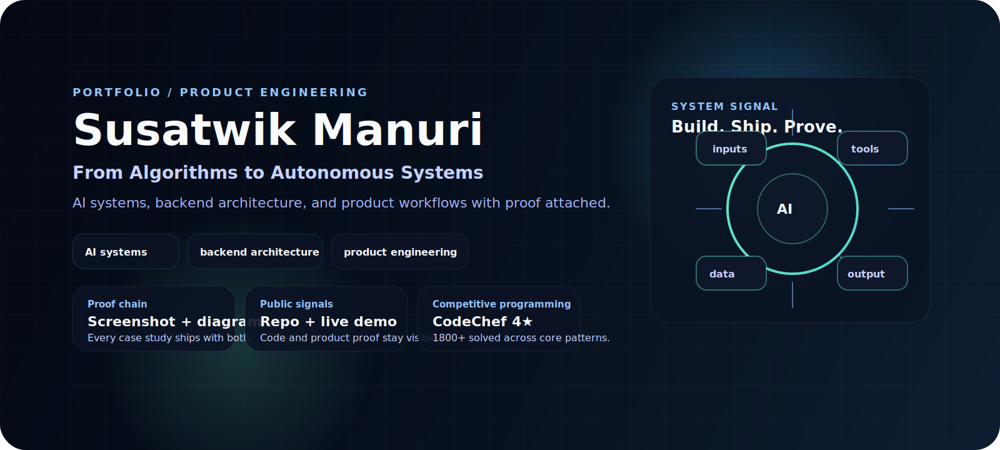

  

<strong>From Algorithms to Autonomous Systems</strong>

Computer Science undergraduate building AI systems, backend products, and shipped demos.

  
  
  
  
  
  

<table>
  <tr>
    <td width="34%"><strong>Focus</strong> AI systems, backend architecture, product engineering</td>
    <td width="33%"><strong>Proof</strong> 4 case studies, 4 repos, 4 live demos</td>
    <td width="33%"><strong>Competitive programming</strong> CodeChef 4★, 1800+ solved, LeetCode</td>
  </tr>
</table>

<table>
  <tr>
    <td width="50%">
      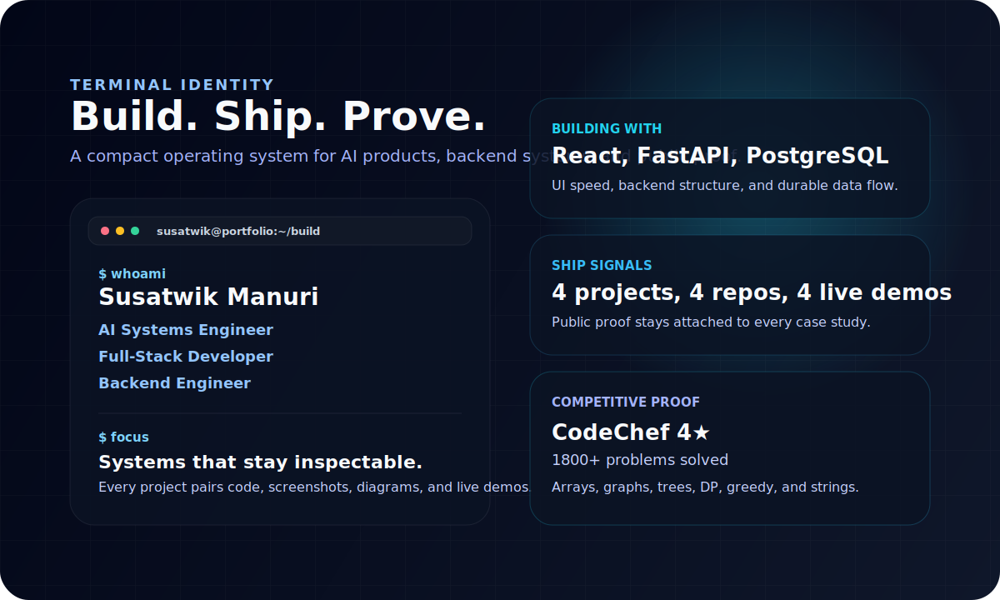
    </td>
    <td width="50%">
      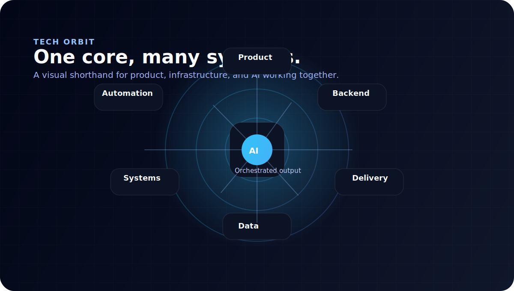
    </td>
  </tr>
</table>

## About Me

<em>I build AI systems and full-stack products where the interface, backend, and AI layer all carry the same standard of proof.</em>

<table>
  <tr>
    <td width="33%">
      <strong>👨‍💻 AI Systems Engineer</strong> 
      Full-Stack Developer 
      Backend Engineer
    </td>
    <td width="33%">
      <strong>🏆 Competitive Programming</strong> 
      CodeChef 4★ 
      1800+ Problems Solved
    </td>
    <td width="34%">
      <strong>🚀 Builder</strong> 
      4 Projects 
      4 Repositories 
      4 Live Demos
    </td>
  </tr>
</table>

## Current Technology Focus

<em>These are the technologies I actively build with.</em>

<table>
  <tr>
    <td width="33%">
      <strong>🔥 Building With</strong> 
      
      
      
       
      
      
       
      These are the tools I use to build the products I ship.
    </td>
    <td width="33%">
      <strong>🧠 Learning</strong> 
      Agentic AI 
      System Design 
      Cloud Architecture 
      MLOps 
      Each week I push deeper into systems that make AI products reliable.
    </td>
    <td width="34%">
      <strong>🚀 Shipping</strong> 
      Career Compass 
      RecoveryMate 
      RestaurantFlow 
      Pawdentify 
      Each project ships with a screenshot, diagram, repository, and live demo.
    </td>
  </tr>
</table>

## Tech Arsenal

<em>Visible at a glance, grouped by the work it supports.</em>

<table>
  <tr>
    <td width="50%">
      <strong>Frontend</strong> 
       
      Interfaces for product polish, speed, and clear hierarchy.
    </td>
    <td width="50%">
      <strong>Backend</strong> 
       
      APIs and services built for stable product workflows.
    </td>
  </tr>
  <tr>
    <td width="50%">
      <strong>Databases</strong> 
       
      Persistence layers for state, auth, and product data.
    </td>
    <td width="50%">
      <strong>AI &amp; GenAI</strong> 
       
      OpenAI APIs, Gemini APIs, RAG systems, and agent workflows.
    </td>
  </tr>
  <tr>
    <td width="50%">
      <strong>DevOps</strong> 
       
      Shipping and deployment across modern cloud surfaces.
    </td>
    <td width="50%">
      <strong>Tools</strong> 
       
      Daily tools for building, debugging, and shipping quickly.
    </td>
  </tr>
</table>

## Engineering DNA

<em>One section, three visuals, one narrative.</em>

<table>
  <tr>
    <td width="33%">
      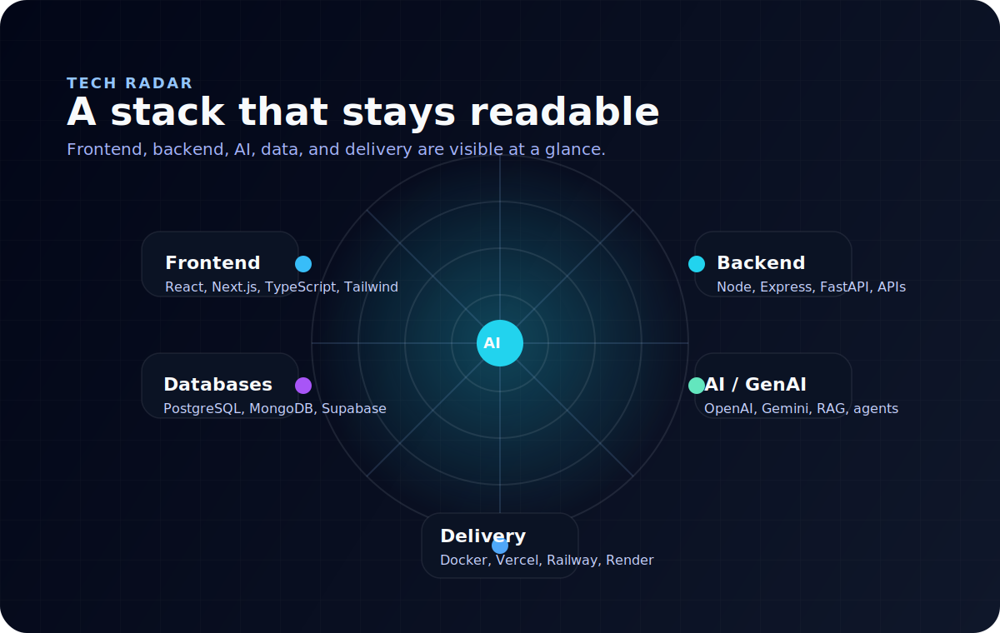 
      Signals I keep visible in every build.
    </td>
    <td width="33%">
      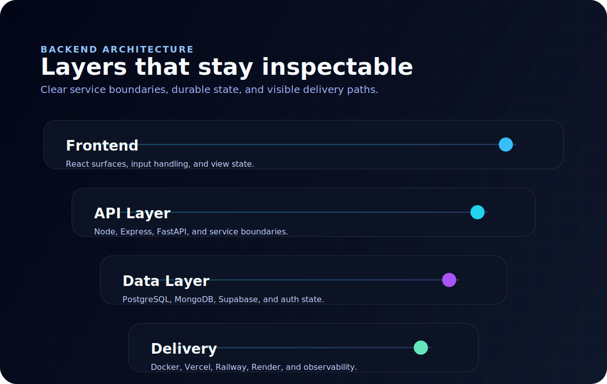 
      Backend boundaries, data flow, and delivery stay explicit.
    </td>
    <td width="34%">
      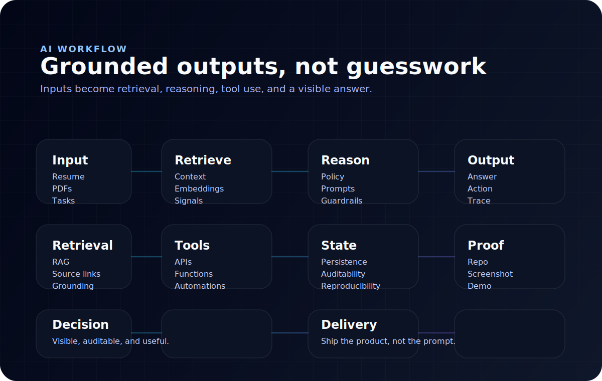 
      AI flows stay grounded in retrieval, tooling, and traceable output.
    </td>
  </tr>
</table>

- Algorithms taught me edge cases.
- Backend work taught me service boundaries.
- AI product work taught me to keep outputs grounded.

## Projects

<em>Screenshot-first case studies with repo and demo proof.</em>

<strong>Career Compass</strong> · resume analysis and interview prep

      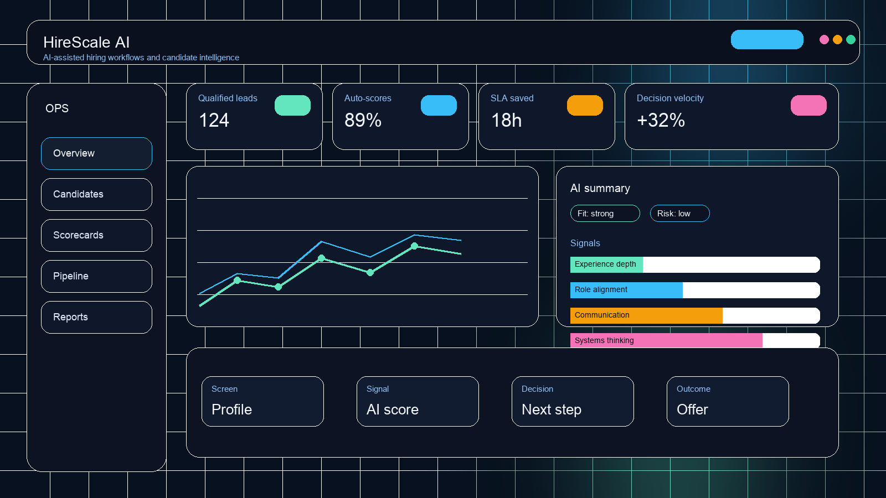

- Stack: React 18, Vite 5, Supabase Auth, Edge Functions, Postgres RLS
- Proof: [screenshot](assets/screenshots/hirescale-dashboard.png) · [diagram](diagrams/hirescale.mmd) · [repo](https://github.com/susatwik/stateful-interview-system) · [demo](https://stateful-interview-system.vercel.app)
- What it demonstrates: document intake, scoring logic, auth-backed persistence, and structured feedback.

<strong>RecoveryMate</strong> · recovery planning and PDF workflows

      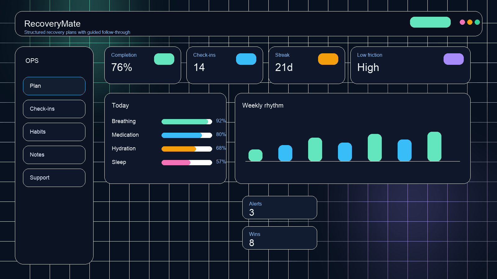

- Stack: Vite React client, Express server, Multer, pdf-parse, @google/genai, MongoDB, Mongoose
- Proof: [screenshot](assets/screenshots/recovermate-dashboard.png) · [diagram](diagrams/recovermate.mmd) · [repo](https://github.com/susatwik/RecoverMate) · [demo](https://recovermate-web.onrender.com)
- What it demonstrates: PDF ingestion, AI-assisted extraction, server-side persistence, and workflow orchestration.

<strong>RestaurantFlow</strong> · order and kitchen coordination

      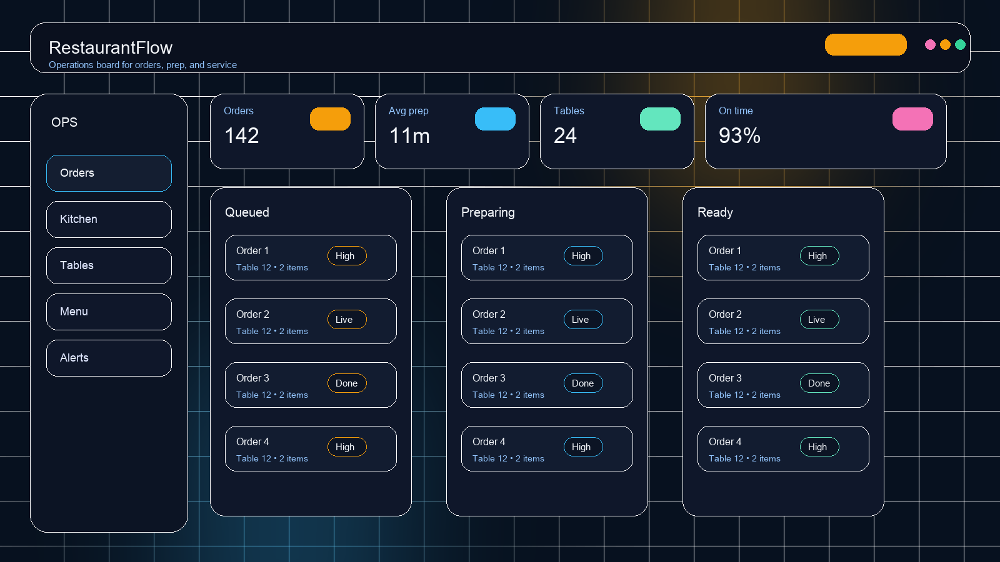

- Stack: dashboard UI, order flow, kitchen board, status updates
- Proof: [screenshot](assets/screenshots/restaurantflow-dashboard.png) · [diagram](diagrams/restaurantflow.mmd) · [repo](https://github.com/susatwik/Restaurant-Ordering-Kitchen-Management-Platform) · [demo](https://restaurant-ordering-kitchen.vercel.app)
- What it demonstrates: operational state tracking, handoff visibility, and service coordination.

<strong>Pawdentify</strong> · pet records and reminders

      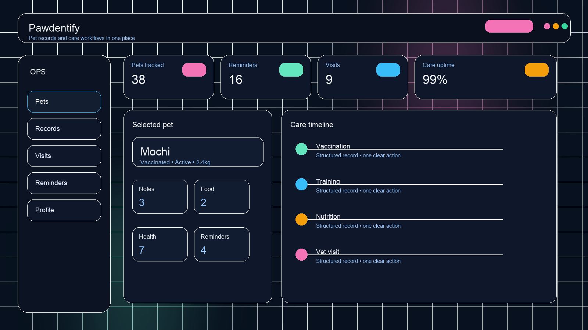

- Stack: pet records UI, visit timeline, reminders
- Proof: [screenshot](assets/screenshots/pawdentify-dashboard.png) · [diagram](diagrams/pawdentify.mmd) · [repo](https://github.com/susatwik/pawdentify) · [demo](https://pawdentify-frontend.vercel.app)
- What it demonstrates: workflow organization for recurring care tasks and record keeping.

  

## Metrics dashboard

<em>Small set of numbers, high signal only.</em>

  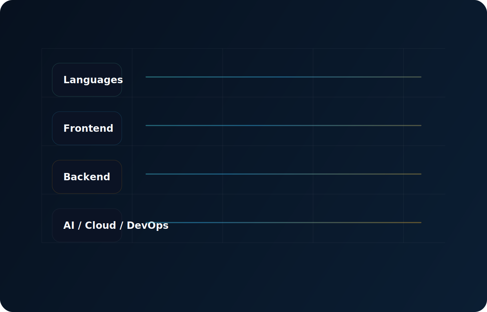

<table>
  <tr>
    <td width="33%"><strong>Showcase projects</strong> 4</td>
    <td width="33%"><strong>Public source repos</strong> 4</td>
    <td width="34%"><strong>Live demos</strong> 4</td>
  </tr>
  <tr>
    <td><strong>CodeChef</strong> 4★</td>
    <td><strong>Problems solved</strong> 1800+</td>
    <td><strong>Architecture diagrams</strong> 4</td>
  </tr>
</table>

<table>
  <tr>
    <td width="50%">
      
    </td>
    <td width="50%">
      
    </td>
  </tr>
</table>

## Connect

<em>Open to product, AI, and systems work.</em>

  
  
  
  

  

  <strong>Susatwik Manuri</strong> 
  From Algorithms to Autonomous Systems 
  Product engineering, AI systems, and backend delivery with proof attached.

