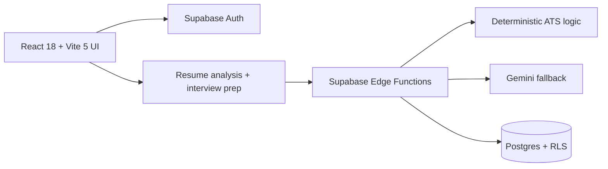
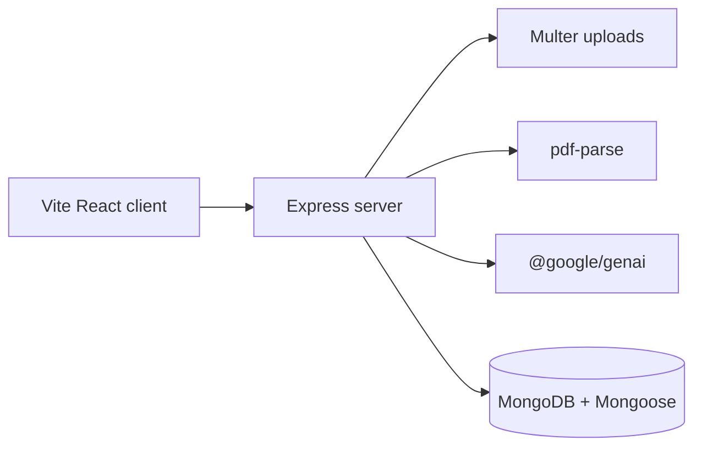
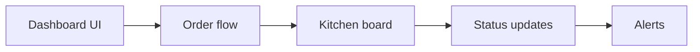
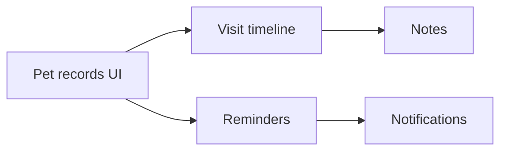

# Susatwik Manuri

  

<strong>From Algorithms to Autonomous Systems</strong>

CS undergraduate building AI systems, backend products, and shipped demos.

  
  
  
  
  
  

<table>
  <tr>
    <td width="34%"><strong>Focus</strong> AI systems, backend architecture, product engineering</td>
    <td width="33%"><strong>Proof</strong> 4 case studies, 4 repos, 4 live demos</td>
    <td width="33%"><strong>Competitive programming</strong> CodeChef 4★, 1800+ solved, LeetCode</td>
  </tr>
</table>

  

## About Me

<em>I build AI systems and full-stack products with evidence attached.</em>

<table>
  <tr>
    <td width="33%"><strong>Who I am</strong> Computer Science undergraduate Full-Stack Developer</td>
    <td width="33%"><strong>What I ship</strong> 4 showcase projects 4 public repos 4 live demos</td>
    <td width="34%"><strong>Why hire me</strong> CodeChef 4★ 1800+ solved problems AI systems focus</td>
  </tr>
</table>

<em>Why this matters: I combine product thinking, backend structure, and algorithmic consistency.</em>

## Proof Highlights

- 4 showcase projects
- 4 public repositories
- 4 live demos
- 1800+ problems solved
- CodeChef 4★
- Multiple production deployments

## Core Identity

<em>Short version: I like product work that still behaves like solid software.</em>

<table>
  <tr>
    <td width="50%">
      <strong>Left lane</strong> 
      Education: Computer Science undergraduate 
      Competitive programming: CodeChef 4★, 1800+ solved 
      Product engineering: dashboards, workflows, demos 
      AI systems: agents, RAG, automation 
      Open-source interest: public repositories and reusable systems
    </td>
    <td width="50%">
      <strong>Right lane</strong> 
      Current direction: build products with stronger systems depth 
      Long-term goals: ship AI products that scale and stay inspectable 
      Research interests: agentic workflows, retrieval, orchestration 
      Specialization: backend architecture, full-stack systems, developer tooling
    </td>
  </tr>
</table>

## What I Love Building

<em>Three problem spaces I keep returning to.</em>

<table>
  <tr>
    <td width="33%">
      <strong>AI Systems</strong> 
      agents 
      RAG systems 
      workflow automation 
      multi-agent systems 
      decision intelligence
    </td>
    <td width="33%">
      <strong>Full-Stack Products</strong> 
      SaaS platforms 
      dashboards 
      productivity tools 
      enterprise workflows 
      customer-facing applications
    </td>
    <td width="34%">
      <strong>Engineering Systems</strong> 
      scalable backend services 
      cloud architecture 
      APIs 
      developer platforms 
      infrastructure tooling
    </td>
  </tr>
</table>

## Current Focus Areas

<em>What I’m building, learning, and looking to collaborate on right now.</em>

<table>
  <tr>
    <td width="50%">
      <strong>Current Technology Focus</strong> 
      Agentic AI 
      RAG Systems 
      Multi-Agent Workflows 
      FastAPI 
      Supabase 
      React 
      TypeScript 
      System Design 
      Cloud Architecture
    </td>
    <td width="50%">
      <strong>Building Now</strong> 
      Career Compass: AI-powered resume and interview platform. 
      RecoveryMate: recovery workflow automation system. 
      RestaurantFlow: restaurant operations platform. 
      Pawdentify: pet identification and recovery platform.
    </td>
  </tr>
  <tr>
    <td width="50%">
      <strong>Looking To Collaborate On</strong> 
      Open source 
      AI products 
      Full-stack applications 
      Developer tools
    </td>
    <td width="50%">
      <strong>Currently Learning</strong> 
      Advanced system design 
      Agentic AI 
      Multi-agent orchestration 
      Cloud architecture 
      Kubernetes 
      MLOps
    </td>
  </tr>
  <tr>
    <td colspan="2"><strong>Seeking Guidance In</strong> Large-scale distributed systems · AI infrastructure · Enterprise architecture</td>
  </tr>
</table>

## Tech Arsenal

<em>Recruiter-friendly stack, strongest tools first.</em>

- Frontend: `React` `TypeScript` `Tailwind`
- Backend: `Node.js` `FastAPI` `Express`
- Database: `PostgreSQL` `Supabase` `MongoDB`
- AI: `OpenAI APIs` `RAG` `Agent Workflows`
- Cloud: `Vercel` `Render` `Railway`
- Tools: `Git` `Docker` `Postman`

## Engineering Philosophy

<em>The rules I use when deciding what to build and how to ship it.</em>

- Build practical products.
- Solve real problems.
- Ship fast.
- Iterate continuously.
- Use evidence and metrics.
- Keep it maintainable and scalable.

## Why I Build

I enjoy building systems that move from idea → architecture → deployment.

Current interests:
- AI agents and workflow automation
- Backend architecture and APIs
- Full-stack SaaS products
- Developer productivity tools
- Production-ready AI applications

## Projects

<em>Screenshot-first case studies with repo and demo proof.</em>

<strong>Career Compass</strong> · resume analysis and interview prep

  

- Stack: React 18, Vite 5, Supabase Auth, Edge Functions, Postgres RLS
- Proof: [screenshot](assets/screenshots/hirescale-dashboard.png) · [diagram](diagrams/hirescale.mmd) · [repo](https://github.com/susatwik/stateful-interview-system) · [demo](https://stateful-interview-system.vercel.app)
- What it demonstrates: document intake, scoring logic, auth-backed persistence, and structured feedback.

<strong>RecoveryMate</strong> · recovery planning and PDF workflows

  

- Stack: Vite React client, Express server, Multer, pdf-parse, @google/genai, MongoDB, Mongoose
- Proof: [screenshot](assets/screenshots/recovermate-dashboard.png) · [diagram](diagrams/recovermate.mmd) · [repo](https://github.com/susatwik/RecoverMate) · [demo](https://recovermate-web.onrender.com)
- What it demonstrates: PDF ingestion, AI-assisted extraction, server-side persistence, and workflow orchestration.

<strong>RestaurantFlow</strong> · order and kitchen coordination

  

- Stack: dashboard UI, order flow, kitchen board, status updates
- Proof: [screenshot](assets/screenshots/restaurantflow-dashboard.png) · [diagram](diagrams/restaurantflow.mmd) · [repo](https://github.com/susatwik/Restaurant-Ordering-Kitchen-Management-Platform) · [demo](https://restaurant-ordering-kitchen.vercel.app)
- What it demonstrates: operational state tracking, handoff visibility, and service coordination.

<strong>Pawdentify</strong> · pet records and reminders

  

- Stack: pet records UI, visit timeline, reminders
- Proof: [screenshot](assets/screenshots/pawdentify-dashboard.png) · [diagram](diagrams/pawdentify.mmd) · [repo](https://github.com/susatwik/pawdentify) · [demo](https://pawdentify-frontend.vercel.app)
- What it demonstrates: workflow organization for recurring care tasks and record keeping.

  

## Operating system

<em>How I work when the product has to feel sharp and the code has to hold up.</em>

  

  

- What I build: AI systems, dashboards, and backend workflows that need to be shipped, not just described.
- How I think: user flow first, data model second, automation last.
- Why AI systems: retrieval, guardrails, and persistence turn demos into products.
- Competitive programming: CodeChef 4★ and 1800+ solved problems keep the algorithmic side sharp.
- Engineering strengths: auth, state management, API design, and end-to-end delivery.

## Brand

<em>The line that ties the portfolio together.</em>

  

- Algorithms → backend systems → AI products → autonomous systems.
- The common thread is shipping useful systems with public proof.

## Journey

<em>The path from problem solving to systems thinking.</em>

  

  

- Algorithms taught me edge cases and tradeoffs.
- Backend work taught me service boundaries and data flow.
- AI product work pushed me toward retrieval, guardrails, and inspectable outputs.

## Systems

<em>Architecture and AI workflow visuals mirror the actual stack.</em>

  

  

- The visuals mirror the stacks used in the repos and demos.
- Each major claim below is backed by a diagram, repo, screenshot, or live deployment.

<strong>Mermaid architecture proofs</strong>

## Metrics dashboard

<em>Small set of numbers, high signal only.</em>

  

<table>
  <tr>
    <td width="33%"><strong>Showcase projects</strong> 4</td>
    <td width="33%"><strong>Public source repos</strong> 4</td>
    <td width="34%"><strong>Live demos</strong> 4</td>
  </tr>
  <tr>
    <td><strong>CodeChef</strong> 4★</td>
    <td><strong>Problems solved</strong> 1800+</td>
    <td><strong>Architecture diagrams</strong> 4</td>
  </tr>
</table>

## Tech stack

<em>Tools I can ship with today.</em>

<strong>Stack details</strong>

Languages: TypeScript, JavaScript, Python, SQL  
Frontend: React, Next.js, Vite, Tailwind CSS, shadcn/ui, Framer Motion  
Backend: Node.js, Express, REST, Webhooks  
Data: PostgreSQL, MongoDB, Redis  
AI: LLMs, RAG, embeddings, tool calling  
Cloud: Vercel, Docker, GitHub Actions  
Tools: Git, Linux, Postman, pnpm, Turbo, VS Code

## Competitive programming

<em>Algorithmic practice remains part of the signal.</em>

<strong>Problem solving</strong>

- Profiles: [CodeChef](https://www.codechef.com/users/susatwik) · [LeetCode](https://leetcode.com/u/susatwik/)
- Strengths: arrays, strings, graphs, dynamic programming, greedy, trees

## Connect

<em>Open to product, AI, and systems work.</em>

  
  
  
  

  

  <strong>Susatwik Manuri</strong> 
  From Algorithms to Autonomous Systems 
  Product engineering, AI systems, and backend delivery with proof attached.

