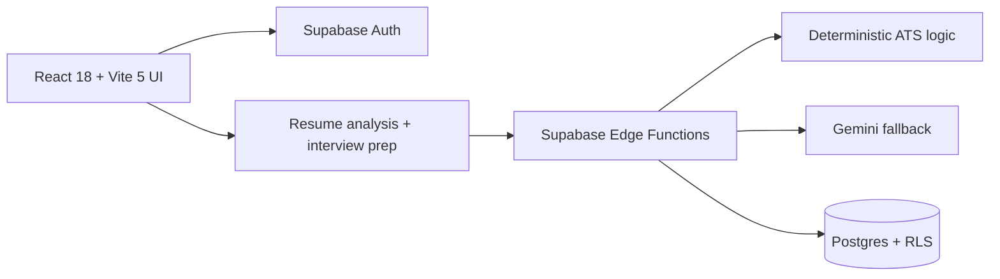
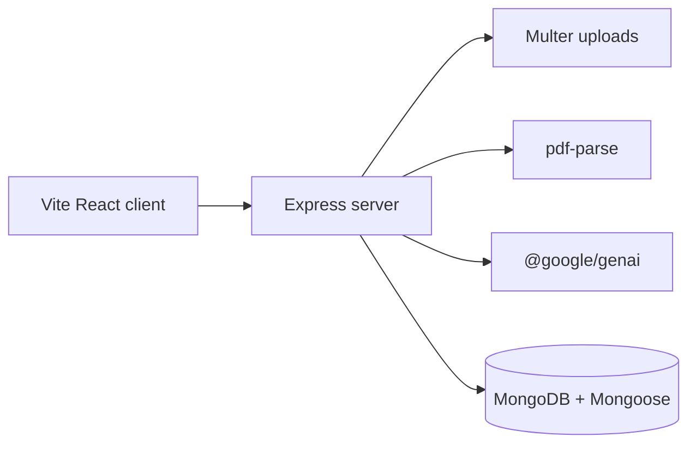
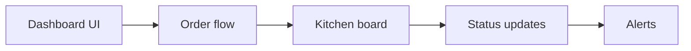
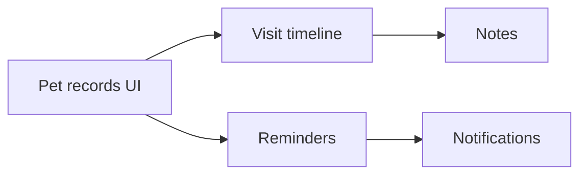

# Susatwik Manuri

<div align="center">
  
</div>

<div align="center">
  <strong>From Algorithms to Autonomous Systems</strong>
</div>

<div align="center">
  CS undergraduate building source-backed AI products, backend systems, and live demos.
</div>

<div align="center">
  <a href="https://github.com/susatwik"></a>
  <a href="https://susatwik-portfolio.vercel.app"></a>
  <a href="https://linkedin.com/in/susatwik/"></a>
  <a href="https://www.codechef.com/users/susatwik"></a>
  <a href="https://leetcode.com/u/susatwik/"></a>
  <a href="mailto:susatwik.manuri@sasi.ac.in"></a>
</div>

## At a glance

- Focus: AI systems, backend architecture, product engineering
- Proof: 4 case studies, 4 repos, 4 live demos
- Competitive programming: CodeChef 4★, 1800+ solved, LeetCode profile
- Brand: From Algorithms to Autonomous Systems

## Hero

<div align="center">
  
</div>

- Who I am: CS undergraduate building AI and backend products.
- What I build: resume analysis, recovery automation, restaurant ops, and pet-care workflows.
- Why it stands out: every project ships with a screenshot, architecture diagram, repo, and demo.

## Projects

<details id="career-compass" open>
<summary><strong>Career Compass</strong></summary>


- Context: Resume analysis and interview prep with Supabase auth, Edge Functions, and RLS-backed storage.
- Proof: [screenshot](assets/screenshots/hirescale-dashboard.png) · [diagram](diagrams/hirescale.mmd) · [repo](https://github.com/susatwik/stateful-interview-system) · [demo](https://stateful-interview-system.vercel.app)

</details>

<details id="recoverymate">
<summary><strong>RecoveryMate</strong></summary>


- Context: Recovery planning with a Vite client, Express server, and MongoDB persistence.
- Proof: [screenshot](assets/screenshots/recovermate-dashboard.png) · [diagram](diagrams/recovermate.mmd) · [repo](https://github.com/susatwik/RecoverMate) · [demo](https://recovermate-web.onrender.com)

</details>

<details id="restaurantflow">
<summary><strong>RestaurantFlow</strong></summary>


- Context: Orders, prep, and service coordination in one board.
- Proof: [screenshot](assets/screenshots/restaurantflow-dashboard.png) · [diagram](diagrams/restaurantflow.mmd) · [repo](https://github.com/susatwik/Restaurant-Ordering-Kitchen-Management-Platform) · [demo](https://restaurant-ordering-kitchen.vercel.app)

</details>

<details id="pawdentify">
<summary><strong>Pawdentify</strong></summary>


- Context: Pet records, visits, and reminders in one place.
- Proof: [screenshot](assets/screenshots/pawdentify-dashboard.png) · [diagram](diagrams/pawdentify.mmd) · [repo](https://github.com/susatwik/pawdentify) · [demo](https://pawdentify-frontend.vercel.app)

</details>

## Brand

<div align="center">
  
</div>

<details>
<summary><strong>Brand narrative</strong></summary>

Algorithms → backend systems → AI products → operational software.

</details>

## Snapshot

<details>
<summary><strong>YAML profile</strong></summary>

```yaml
identity:
  name: Susatwik Manuri
  role: CS undergraduate
  location: India

focus:
  primary: AI systems and backend architecture
  secondary: RAG workflows and automation

proof:
  projects: 4
  demos: 4

competitive_programming:
  codechef: 4★
  solved: 1800+
```

</details>

## Architecture

<details>
<summary>Career Compass</summary>



</details>

<details>
<summary>RecoveryMate</summary>



</details>

<details>
<summary>RestaurantFlow</summary>



</details>

<details>
<summary>Pawdentify</summary>



</details>

## Metrics dashboard

<table>
  <tr>
    <td><strong>Showcase projects</strong><br />4</td>
    <td><strong>Public source repos</strong><br />4</td>
    <td><strong>Live demos</strong><br />4</td>
  </tr>
  <tr>
    <td><strong>CodeChef</strong><br />4★</td>
    <td><strong>Problems solved</strong><br />1800+</td>
    <td><strong>Brand</strong><br />From Algorithms to Autonomous Systems</td>
  </tr>
</table>

<div align="center">
  
  
</div>

## Tech stack

<details>
<summary><strong>Stack details</strong></summary>

Languages: TypeScript, Python, JavaScript, SQL, Bash  
Frontend: React, Next.js, Tailwind CSS, shadcn/ui, Framer Motion  
Backend: Node.js, Express, REST, Webhooks  
Data: PostgreSQL, MongoDB, Redis  
AI: LLMs, RAG, embeddings, tool calling  
Cloud: Vercel, Docker, Kubernetes  
DevOps: GitHub Actions, CI/CD, observability  
Tools: Git, Linux, Postman, pnpm, Turbo, VS Code

</details>

## Competitive programming

<details>
<summary><strong>Problem solving</strong></summary>

- Profiles: [CodeChef](https://www.codechef.com/users/susatwik) · [LeetCode](https://leetcode.com/u/susatwik/)
- Strengths: arrays, strings, graphs, dynamic programming, greedy, trees

</details>

## Connect

<div align="center">
  <a href="https://susatwik-portfolio.vercel.app/"></a>
  <a href="https://linkedin.com/in/susatwik/"></a>
  <a href="https://github.com/susatwik"></a>
  <a href="mailto:susatwikmanuri@sasi.ac.in"></a>
</div>

<div align="center">
  
</div>
