# Susatwik Manuri

  

<strong>From Algorithms to Autonomous Systems</strong>

CS undergraduate building AI systems, backend products, and shipped demos.

  
  
  
  
  
  

<table>
  <tr>
    <td width="34%"><strong>Focus</strong> AI systems, backend architecture, product engineering</td>
    <td width="33%"><strong>Proof</strong> 4 case studies, 4 repos, 4 live demos</td>
    <td width="33%"><strong>Competitive programming</strong> CodeChef 4★, 1800+ solved, LeetCode</td>
  </tr>
</table>

  

## Projects

<strong>Career Compass</strong> · resume analysis and interview prep

  

- Stack: React 18, Vite 5, Supabase Auth, Edge Functions, Postgres RLS
- Proof: [screenshot](assets/screenshots/hirescale-dashboard.png) · [diagram](diagrams/hirescale.mmd) · [repo](https://github.com/susatwik/stateful-interview-system) · [demo](https://stateful-interview-system.vercel.app)
- What it demonstrates: document intake, scoring logic, auth-backed persistence, and structured feedback.

<strong>RecoveryMate</strong> · recovery planning and PDF workflows

  

- Stack: Vite React client, Express server, Multer, pdf-parse, @google/genai, MongoDB, Mongoose
- Proof: [screenshot](assets/screenshots/recovermate-dashboard.png) · [diagram](diagrams/recovermate.mmd) · [repo](https://github.com/susatwik/RecoverMate) · [demo](https://recovermate-web.onrender.com)
- What it demonstrates: PDF ingestion, AI-assisted extraction, server-side persistence, and workflow orchestration.

<strong>RestaurantFlow</strong> · order and kitchen coordination

  

- Stack: dashboard UI, order flow, kitchen board, status updates
- Proof: [screenshot](assets/screenshots/restaurantflow-dashboard.png) · [diagram](diagrams/restaurantflow.mmd) · [repo](https://github.com/susatwik/Restaurant-Ordering-Kitchen-Management-Platform) · [demo](https://restaurant-ordering-kitchen.vercel.app)
- What it demonstrates: operational state tracking, handoff visibility, and service coordination.

<strong>Pawdentify</strong> · pet records and reminders

  

- Stack: pet records UI, visit timeline, reminders
- Proof: [screenshot](assets/screenshots/pawdentify-dashboard.png) · [diagram](diagrams/pawdentify.mmd) · [repo](https://github.com/susatwik/pawdentify) · [demo](https://pawdentify-frontend.vercel.app)
- What it demonstrates: workflow organization for recurring care tasks and record keeping.

  

## Operating system

  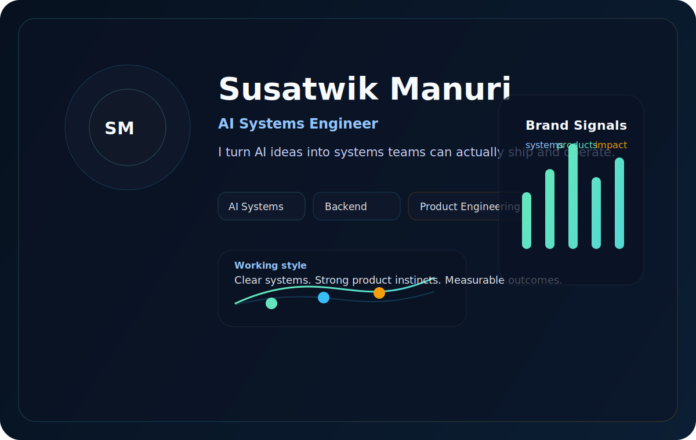

  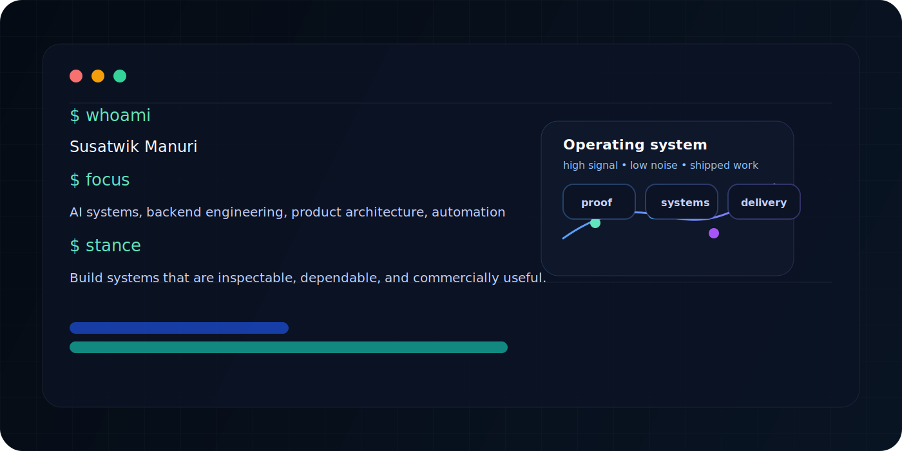

- What I build: AI systems, dashboards, and backend workflows that need to be shipped, not just described.
- How I think: define the user flow first, then the data model, then the automation layer.
- Why AI systems: useful AI needs retrieval, guardrails, persistence, and a clean product handoff.
- Competitive programming background: CodeChef 4★ and 1800+ solved problems keep the algorithmic side sharp.
- Engineering strengths: auth, state management, API design, and end-to-end delivery.

## Brand

  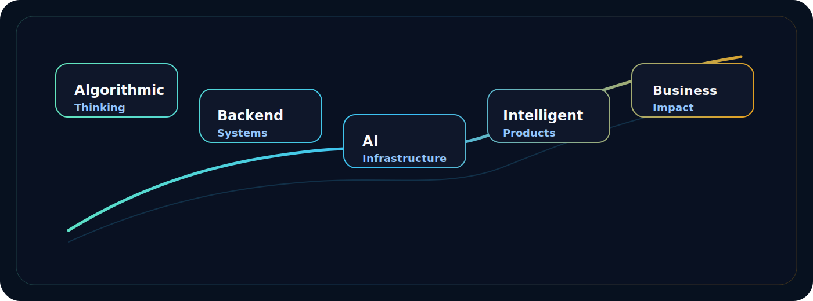

- Algorithms → backend systems → AI products → autonomous systems.
- The common thread is shipping useful systems with public proof.

## Journey

  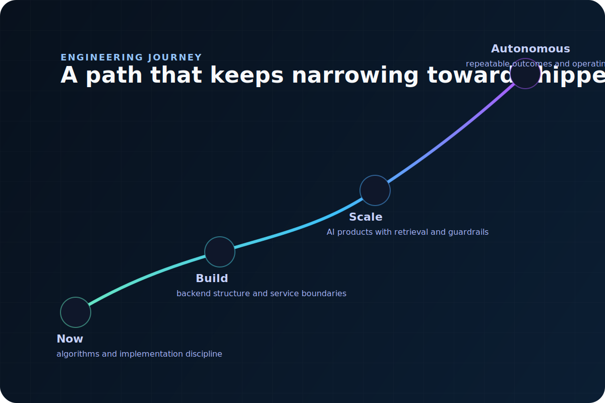

  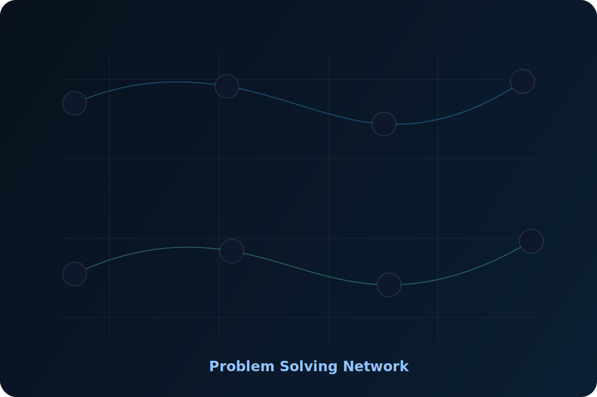

- Algorithms taught me edge cases, runtime tradeoffs, and precision.
- Backend work taught me service boundaries, state transitions, and data flow.
- AI product work pushed me toward retrieval, guardrails, and inspectable outputs.

## Systems

  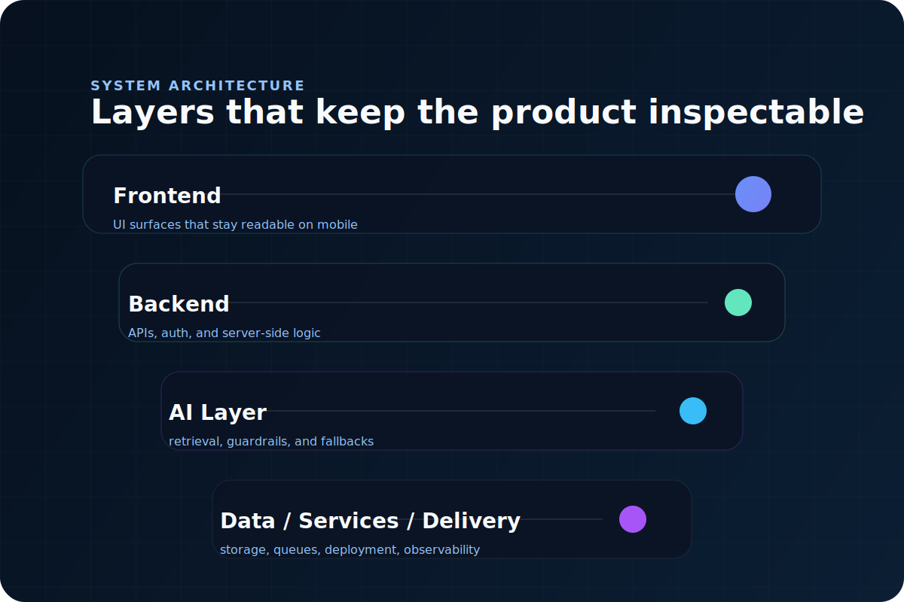

  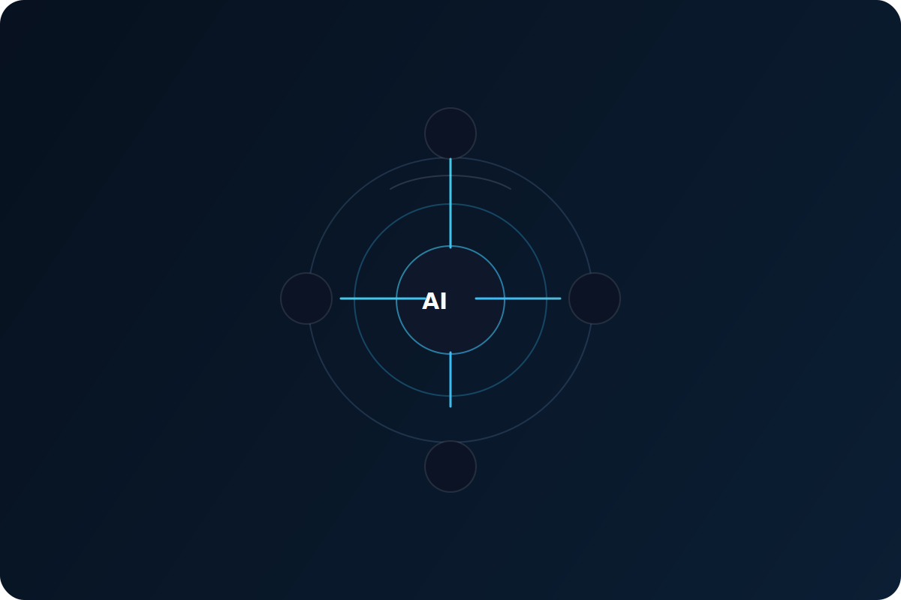

- The visuals mirror the actual stacks used in the repos and demos.
- Each major claim below is backed by a diagram, repo, screenshot, or live deployment.

<strong>Mermaid architecture proofs</strong>

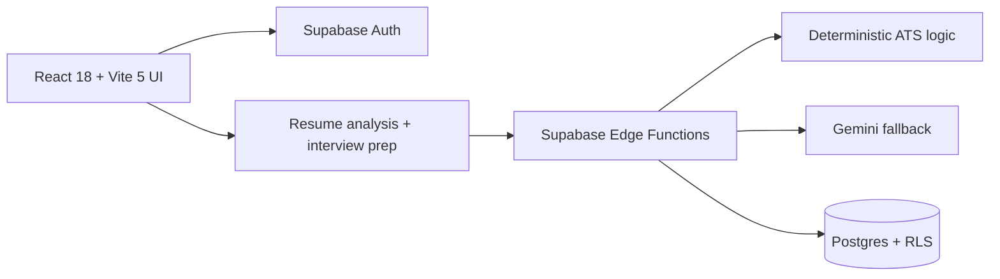

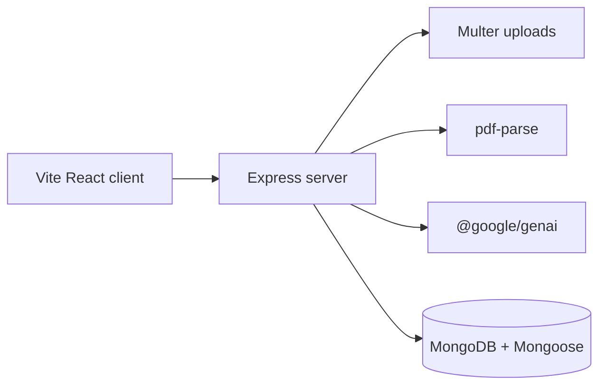

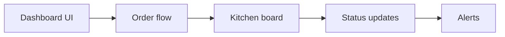

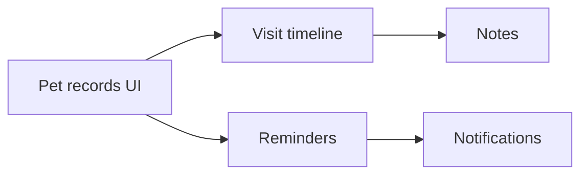

## Metrics dashboard

  

<table>
  <tr>
    <td width="33%"><strong>Showcase projects</strong> 4</td>
    <td width="33%"><strong>Public source repos</strong> 4</td>
    <td width="34%"><strong>Live demos</strong> 4</td>
  </tr>
  <tr>
    <td><strong>CodeChef</strong> 4★</td>
    <td><strong>Problems solved</strong> 1800+</td>
    <td><strong>Architecture diagrams</strong> 4</td>
  </tr>
</table>

## Tech stack

<strong>Stack details</strong>

Languages: TypeScript, JavaScript, Python, SQL  
Frontend: React, Next.js, Vite, Tailwind CSS, shadcn/ui, Framer Motion  
Backend: Node.js, Express, REST, Webhooks  
Data: PostgreSQL, MongoDB, Redis  
AI: LLMs, RAG, embeddings, tool calling  
Cloud: Vercel, Docker, GitHub Actions  
Tools: Git, Linux, Postman, pnpm, Turbo, VS Code

## Competitive programming

<strong>Problem solving</strong>

- Profiles: [CodeChef](https://www.codechef.com/users/susatwik) · [LeetCode](https://leetcode.com/u/susatwik/)
- Strengths: arrays, strings, graphs, dynamic programming, greedy, trees

## Connect

  
  
  
  

  

  <strong>Susatwik Manuri</strong> 
  From Algorithms to Autonomous Systems 
  Product engineering, AI systems, and backend delivery with proof attached.

